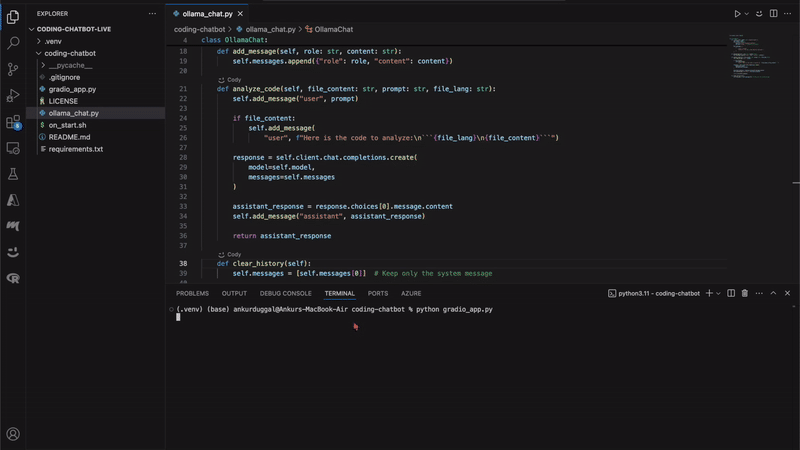

# Let's Build A Coding Chatbot

## How To Run The Chatbot

Make sure you have Git & Python Installed

## 1. Clone the Repository
```bash
git clone https://github.com/coding-chatbot/coding-chatbot.git
```

## 1.5 (If running locally & not on Linux make sure you have Ollama Installed)
If you do not have Ollama installed you can install it here: [Ollama Downlaod](https://ollama.com/download)

## 2. Run `on_start.sh`
### Uncomment these lines from `on_start.sh` if running locally and save it:
```bash
# python -m venv .venv # Uncomment if running locally
# source .venv/bin/activate # Uncomment if running locally
```
Uncomment by highlighting them and pressing `CTRL (CMD on Mac) \`

This will create a virtual environment to download all the Python dependencies.

```bash
cd coding-chatbot
chmod +x on_start.sh
./on_start.sh
```
## 3. Run Gradio
```bash
python gradio_app.py
```

## 4. Open the URL in your browser
The url should be [http://127.0.0.1:7860](http://127.0.0.1:7860)

## Example Display


## Tools Used
- [Gradio](https://gradio.app/)
- [OpenAI SDK](https://openai.com/)
- [Ollama](https://ollama.com/)
- [Qwen2.5-Coder](https://qwenlm.github.io/blog/qwen2.5-coder/)
