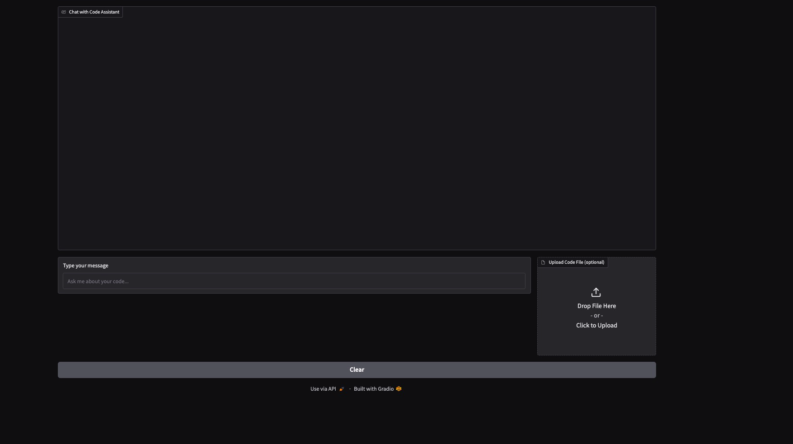

# Let's Build A Coding Chatbot

## Make sure you have Git & Python Installed

## Clone the Repository
```bash
git clone https://github.com/coding-chatbot/coding-chatbot.git
```

## Run on_start.sh
```bash
cd coding-chatbot
chmod +x on_start.sh
./on_start.sh
```
## Run Gradio
```bash
python gradio_app.py
```

## Open the URL in your browser
The url should be http://127.0.0.1:7860

## Example Display
